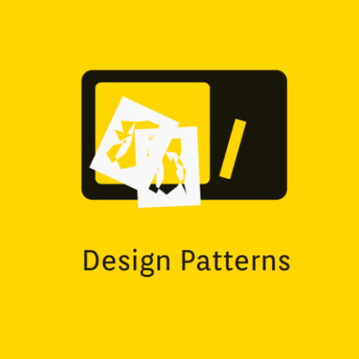
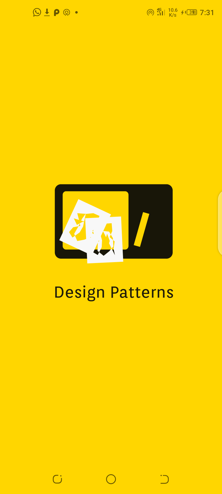
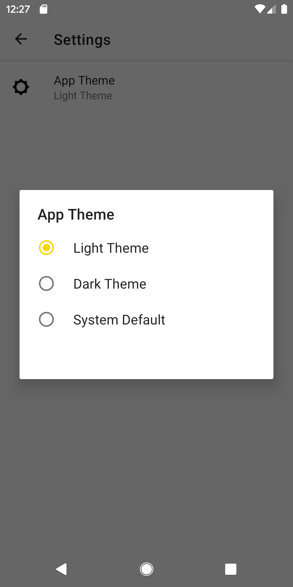
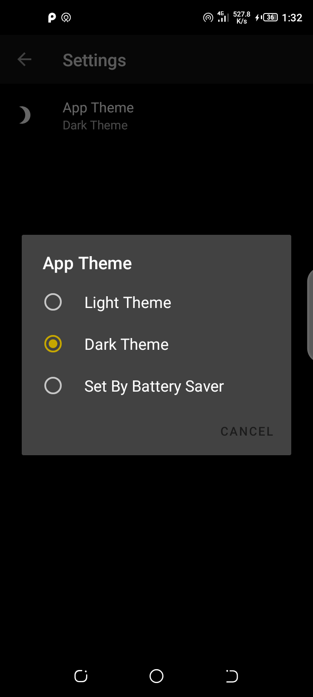
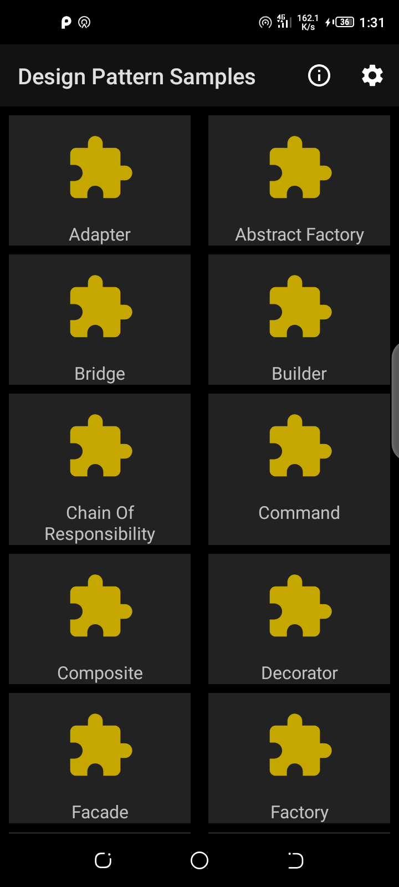
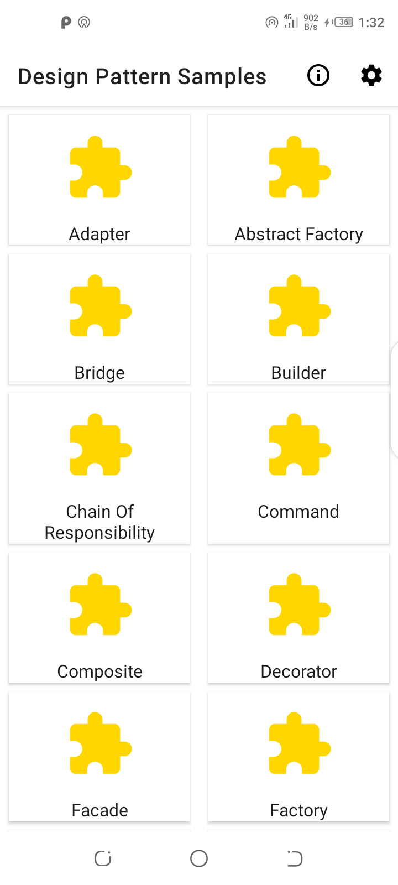
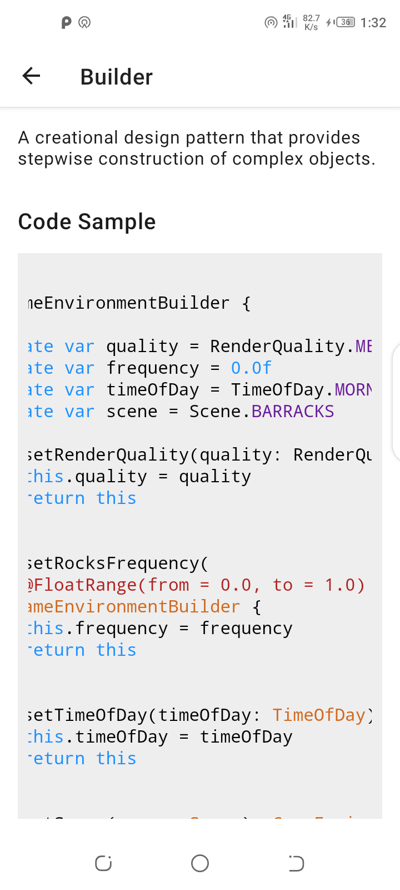
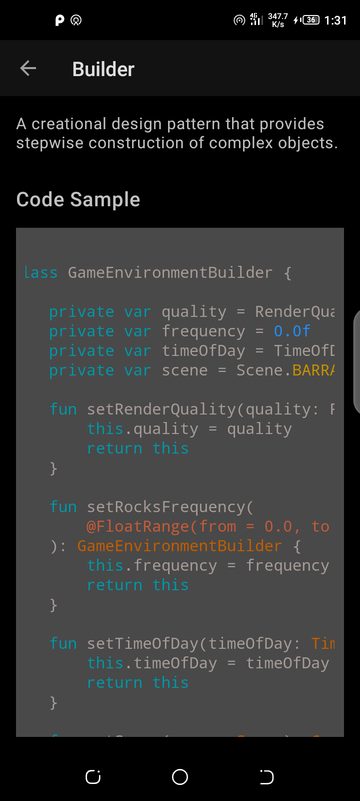
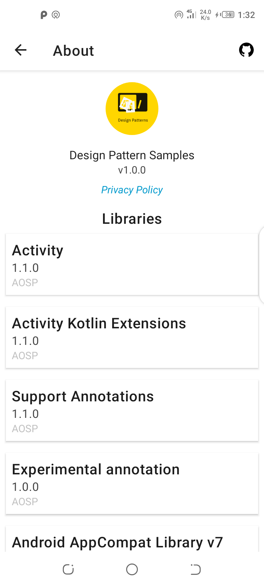
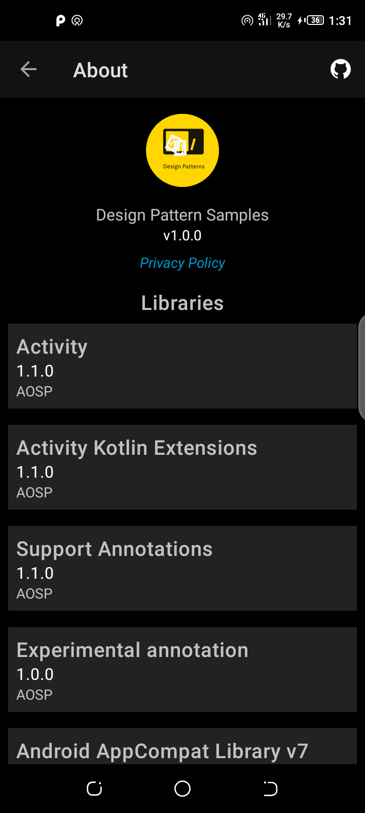

<p align="center">

</p>
<p align="center">
<a href="https://www.codacy.com?utm_source=github.com&amp;utm_medium=referral&amp;utm_content=odaridavid/Design-Pattern-Samples-App&amp;utm_campaign=Badge_Grade"></a>

</p>

## Patrones de diseño 

Exploracion Conductual, Creacional y Estructural de Patrones de Diseño en Kotlin.

Sientete libre de mejorar o proporcionar comentarios en cualquiera de los patrones.

## Prerequisitos

El proyecto usas crashlytics de firebase, por lo que establecer una [projecto de firebase](https://firebase.google.com/)
sera requerido para una construccion exitosa.

## Mas Referencias

- [Design-Patterns-In-Kotlin](https://github.com/dbacinski/Design-Patterns-In-Kotlin)
- [Refactoring Guru Design Patterns](https://refactoring.guru/design-patterns)
- [Wikipedia](https://en.wikipedia.org/wiki/Software_design_pattern)

## Capturas de pantalla

||||
|:--:|:--:|:--:|
|Splash Activity|Settings(Q >)|Settings(< Q)|

||||
|:--:|:--:|:--:|
|Dashboard(Dark)|Dashboard(Light)|Description(Light)|

||||
|:--:|:--:|:--:|
|Description(Dark)|About(Light)|About(Dark)|

<a href='https://play.google.com/store/apps/details?id=com.github.odaridavid.designpatterns&pcampaignid=pcampaignidMKT-Other-global-all-co-prtnr-py-PartBadge-Mar2515-1'></a>

## Atribuciones

Google Play y el logo de Google Play son marcas registradas de Google LLC.

<a target="_blank" href="https://icons8.com/icons/set/github">GitHub icon</a> icon by <a target="_blank" href="https://icons8.com">Icons8</a>

## Licencia

```
  Copyright 2020 David Odari
 
   Licenciado bajo la Licencia Apache, Versión 2.0 (la "Licencia");
   no puede utilizar este archivo excepto de conformidad con la Licencia. Tú
   puede obtener una copia de la Licencia en.
              http://www.apache.org/licenses/LICENSE-2.0
   A menos que lo exija la ley aplicable o se acuerde por escrito, el software
   distribuido bajo la Licencia se distribuye "TAL CUAL",
   SIN GARANTÍAS NI CONDICIONES DE NINGÚN TIPO, ya sean expresas o implícitas.
   Consulte la Licencia para conocer el idioma específico que rige los permisos y
   limitaciones bajo la Licencia.
```

## [Politicas de Privacidad](https://design-patterns.flycricket.io/privacy.html)


